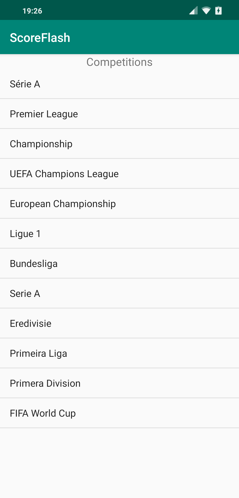
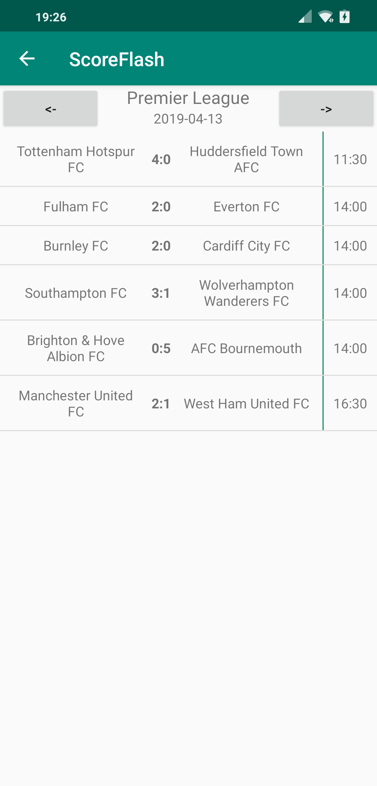
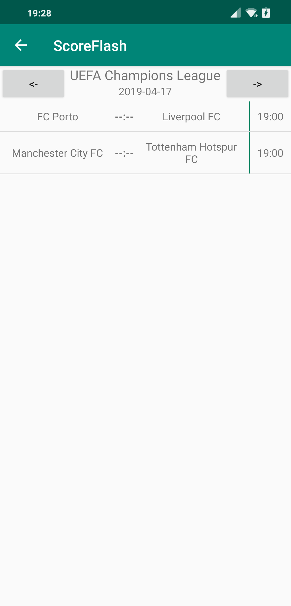
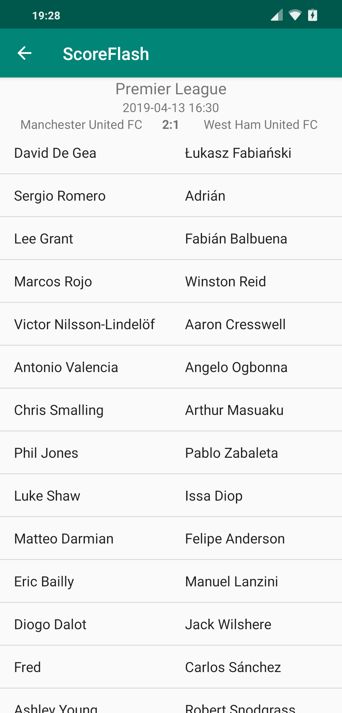

# ScoreFlash

Android app that shows scores of football games.  
Uses fee data plan from https://www.football-data.org/
To make it works, you have to provide your custom token in file: *ScoreFlash/app/src/main/java/footballdata/DataSource.java*

## Screenshots:
&nbsp;
  
&nbsp;
  
